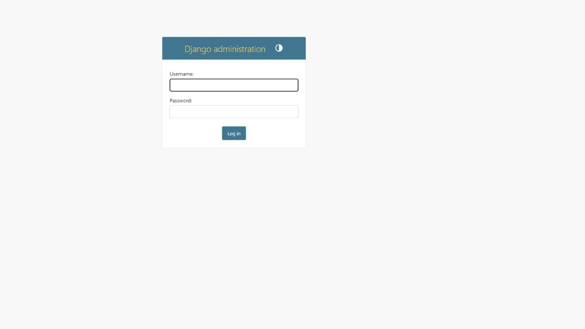
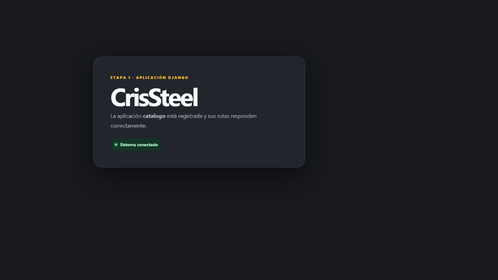
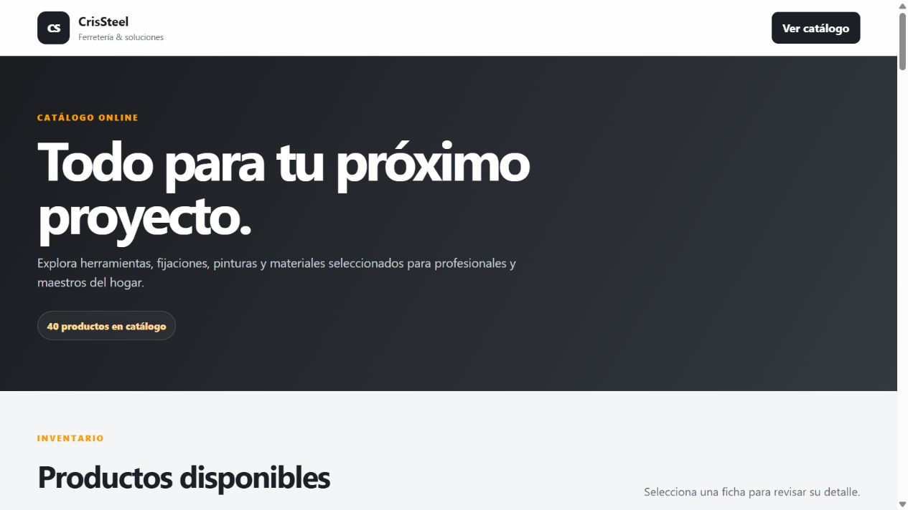
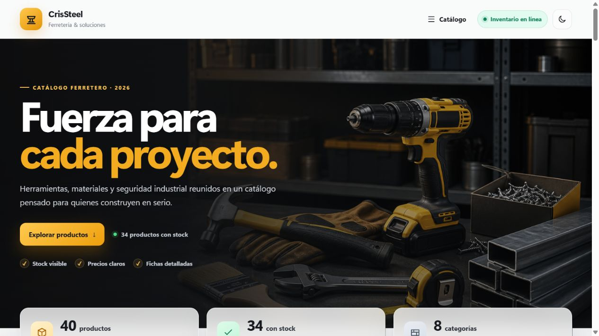
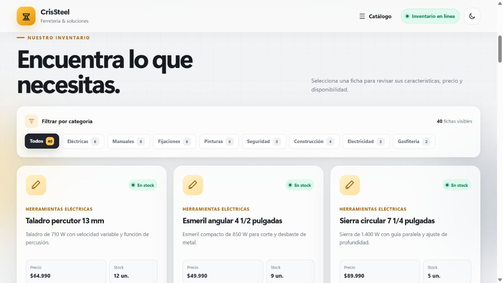
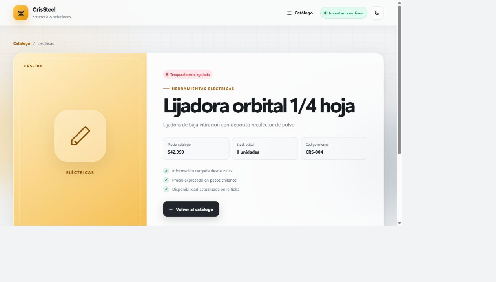
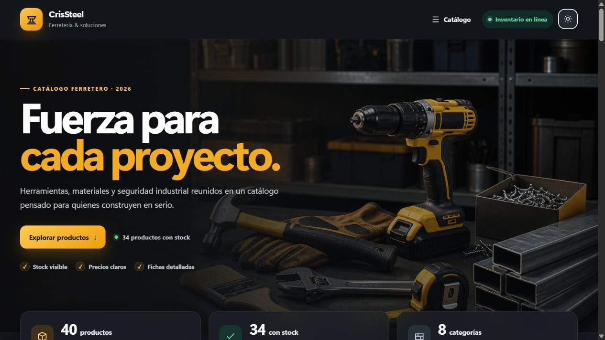
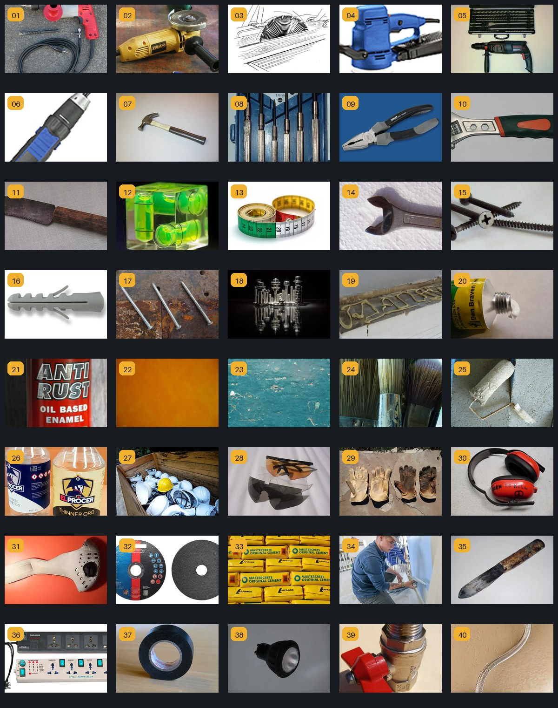

# Evidencias de los commits

Cada etapa se cerró con el mensaje solicitado por la pauta. Las capturas están guardadas en el mismo repositorio para que la progresión se pueda revisar sin depender de enlaces externos.

## 1. `etapa-0-entorno`

Se creó el entorno virtual, se instaló Django 5.2.5, se generó `requirements.txt`, se inició el proyecto `config` y se configuró un repositorio Git independiente.

## 2. `etapa-1-app`

Se creó y registró la aplicación `catalogo`, se conectaron sus URLs mediante `include` y se comprobó una vista mínima.

## 3. `etapa-2-interfaz`

Se incorporaron los 40 productos en JSON dentro de `views.py`, los templates heredados, el bucle completo del catálogo y la vista detalle por id.

## 4. `etapa-3-mejoras`

Se agregaron el resumen calculado, los estados de disponibilidad, el destacado condicional, los filtros, el tema visual, iconos SVG y la imagen original de portada.

## 5. `entrega-final`

Se completaron el registro de consultas a IA, la guía de ejecución, el índice de evidencias y la verificación final del proyecto. La Parte 2 de `uso_ia.md` se dejó identificada para que el estudiante la redacte personalmente antes de subir el repositorio a GitHub.

## Evidencia adicional - catálogo visual autocontenido

Se buscaron 40 imágenes abiertas en Wikimedia Commons, se revisó visualmente su correspondencia con el inventario y se integraron como WebP en Base64. La siguiente hoja de contacto permite comprobar de una sola vez que cada id tiene una imagen propia; la autoría y licencia están detalladas en `fuentes_imagenes.md`.

